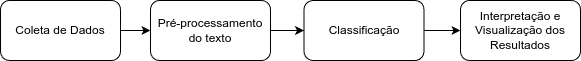

# **Sentilytics**

## Análise Automatizada de Sentimentos em Redes Sociais

Autor: José Alessandro Santos Santana
**Bacharelado em Sistemas de Informação**
Orientador: Prof. Dr. Gilson Pereira dos Santos Júnior

<!-- _footer: '12 de março de 2025' -->

---

<!-- _header: SUMÁRIO -->

- Introdução
  - Contextualização do Tema
  - Problema de Pesquisa
- Objetivos
  - Objetivo Geral
  - Objetivos específicos
- Fundamentação Teórica
  - Análise de Sentimentos
  - Análise de Sentimentos em Redes sociais
  - Processo de Análise de Sentimentos em Aplicações

---

<!-- _header: SUMÁRIO -->

- Sentilytics
  - Diagrama de componentes
  - BPMN: Do Cadastro da Pesquisa à Visualização dos Resultados
  - Dicionário de Dados
  - Demonstração Visual da Aplicação
  - Vídeo Demonstrativo
- Estudo de Caso
- Conclusão
- Trabalhos Futuros
- Referências

---

<!-- _header: CONTEXTUALIZAÇÃO DO TEMA -->

As redes sociais são um ambiente digital dinâmico, onde milhões de pessoas expressam suas percepções sobre temas variados.

- Expressão de **opiniões**, **sentimentos** e **tendências**;
- Discussão de temas políticos e a **articulação política**;
- Conta com a presença de empresas;
- Utilizada por jovens para o entretenimento, mobilização e conscientização social.

---

<!-- _header: CONTEXTUALIZAÇÃO DO TEMA -->

A análise de sentimentos permite interpretar emoções expressas em textos.

- Compreensão de tendências e comportamentos;
- Identificação de polarizações em debates públicos;
- **Apoio à tomada de decisões** em comunicação, política e negócios.

Na literatura, podemos encontrar diversas ferramentas que aplicam a análise de sentimentos em redes sociais.

---

<!-- _header: PROBLEMA DE PESQUISA -->

As aplicações desenvolvidas para a análise de sentimentos em redes sociais enfrentam desafios significativos.

- Soluções desenvolvidas geralmente não são intuitivas;
- Não oferecem processamento de ponta a ponta;
- Falta ou dificuldade na personalização;
- Muitas vezes não possui integração direta com redes sociais.

---

<!-- _header: OBJETIVOS -->

Analisar sentimentos de forma automatizada em redes sociais por meio de uma solução integrada denominada Sentilytics.

- Implementar a coleta automatizada de dados em redes sociais integradas à aplicação.
- Desenvolver um módulo de pré-processamento customizável para normalização e remoção de stopwords.
- Integrar o modelo de análise de sentimentos VADER à aplicação para classificar sentimentos.

---

<!-- _header: OBJETIVOS -->

- Exibir os resultados da análise de sentimentos por meio de gráficos, tabelas e nuvens de palavras.
- Avaliar a aplicação por meio de um estudo de caso sobre o debate do fim da escala 6x1.

---

<!-- _header: ANÁLISE DE SENTIMENTOS -->

**Identifica emoções em textos**: Positivo, negativo ou neutro

**Principais técnicas**:

**Baseadas em léxicos**: Dicionários de palavras categorizadas

**Aprendizado de máquina**: Modelos treinados para prever sentimentos

**Abordagem hibrida**: Combina técnicas baseadas em léxicos com o aprendizado de máquina

---

<!-- _header: PROCESSO DE ANÁLISE DE SENTIMENTOS EM APLICAÇÕES -->

---

<!-- _header: ANÁLISE DE SENTIMENTOS EM REDES SOCIAIS -->

A **análise de sentimentos** em **redes sociais** enfrenta desafios.

- **Volume de dados** torna a análise manual inviável;
- Elementos visuais (imagens, vídeo);
- Simbólicos (emojis, hashtags);
- Gírias e sarcasmo;
- Erros de ortografia.

---

<!-- _header: SENTILYTICS: DIAGRAMA DE COMPONENTES -->

---

<!-- _header: DO CADASTRO DA PESQUISA À VISUALIZAÇÃO DOS RESULTADOS -->

---

<!-- _header: DIAGRAMA ENTIDADE RELACIONAMENTO -->

---

<!-- _header: DICIONÁRIO DE DADOS -->

---

<!-- _header: DEMONSTRAÇÃO VISUAL DA APLICAÇÃO -->

---

<!-- _header: DEMONSTRAÇÃO VISUAL DA APLICAÇÃO -->

---

<!-- _header: DEMONSTRAÇÃO VISUAL DA APLICAÇÃO -->

Os dados que serão analisados podem ser importados da rede social Bluesky e/ou arquivo CSV.

---

<!-- _header: DEMONSTRAÇÃO VISUAL DA APLICAÇÃO -->

---

<!-- _header: DEMONSTRAÇÃO VISUAL DA APLICAÇÃO -->

---

<!-- _header: ESTUDO DE CASO: ESCALA 6x1 -->

O Sentilytics foi aplicado para analisar a percepção da escala 6x1 em redes sociais, identificando sentimentos e padrões de engajamento sobre o tema.

Objetivo: Analisar sentimentos e tendências sobre a escala 6x1
Dados coletados: 4.880 postagens no **Bluesky**

Metodologia:

- Coleta de dados no Bluesky via Sentilytics;
- Pré-processamento e classificação automática dos sentimentos;

---

<!-- _header: ESTUDO DE CASO: ESCALA 6x1 -->

Objetivo: Analisar sentimentos e tendências sobre a escala 6x1
Dados coletados: 4.880 postagens no **Bluesky**

Resultados:

- **87,3%** das postagens foram classificadas como **neutras**.
- **10,5% positivas** | **2,2% negativas**.
- **Sentimentos negativos geraram maior engajamento** (mais likes e reposts).
- **Tendência favorável** à mudança da escala 6x1.
Sentilytics: Automatizou coleta, pré-processamento e análise dos dados.

---

<!-- _header: CONCLUSÃO -->

**Sentilytics:** Solução **integrada e automatizada** para análise de sentimentos.

**Diferenciais:**

- **Coleta, pré-processamento e classificação** personalizáveis
- Integração com a rede social Bluesky
- **Acesso intuitivo**, mesmo sem experiência técnica

**Impacto:** Monitoramento de redes, pesquisas acadêmicas e decisões estratégicas.

---

<!-- _header: TRABALHOS FUTUROS -->

O Sentilytics pode ser aprimorado e expandido para tornar a análise de sentimentos ainda mais eficiente e abrangente.

- Integração de **novos modelos** de **análise de sentimentos**;
- Inclusão de **novos algoritmos** de **pré-processamento**;
- Incluir o suporte a múltiplas sociais;
- Painel administrativo.

---

<!-- _header: REFERÊNCIAS -->

BERTAGLIA, T. F. C.; NUNES, M. d. G. V. Exploring word embeddings for unsupervised textual user-generated content normalization. In: *Proceedings of the 2nd Workshop on Noisy User-generated Text (WNUT)*. [S.l.: s.n.], 2016. p. 112–120.

CARVALHO, L. B. d. D. A democracia frustrada: fake news, política e liberdade de expressão nas redes sociais. *Internet e Sociedade,[S. l.]*, v. 1, n. 1, p. 172–199, 2020.

LIMA, P. R. S. et al. Redes sociais como ferramentas de transparência em tempos de covid-19: uma análise das publicações dos boletins epidemiológicos do estado de alagoas. *Logeion: Filosofia da Informação*, v. 7, n. 2, p. 88–107, 2021.

---

<!-- _header: REFERÊNCIAS -->

POMPEI, T.; GOUVEIA, L. M. B.; RAMOS, P. F. M. d. S. Redes sociais: influência,
identidade e diferença na contemporaneidade. *Revista em Sociedade, Belo Horizonte*, v. 3, n. 2, p. 93–111, 2021.

SANTANA, B. S.; FREITAS, L. A. de. Capítulo 23 pln em redes sociais. 2023.

SIQUEIRA, L. F. et al. O impacto das mídias sociais na saúde mental de adolescentes e jovens adultos. *Brazilian Journal of Implantology and Health Sciences*, v. 6, n. 10, p. 1384–1390, 2024.

---

Obrigado!

  

    
    
Acesso ao documento

  

  

    
    
Vídeo demonstrativo da aplicação

  

---

<!-- _header: ACESSO AO DOCUMENTO -->

---

<!-- _header: VÍDEO DEMONSTRATIVO DA APLICAÇÃO -->

